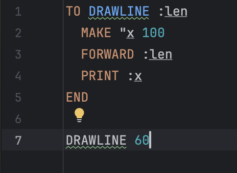
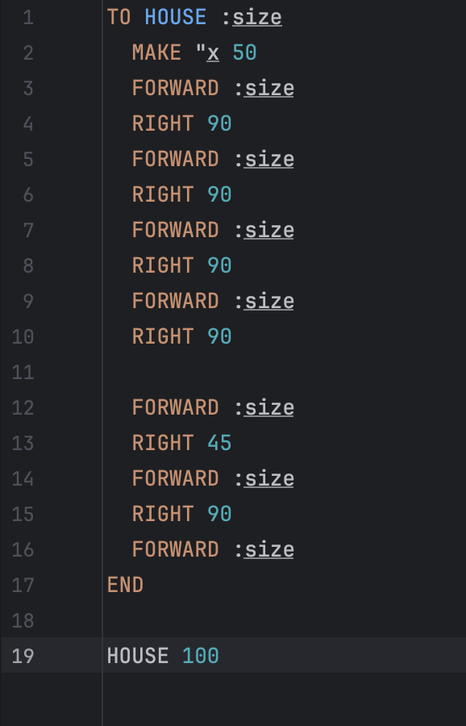
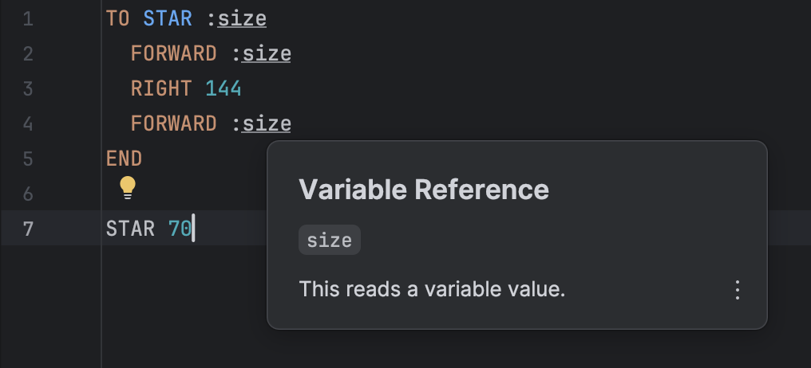
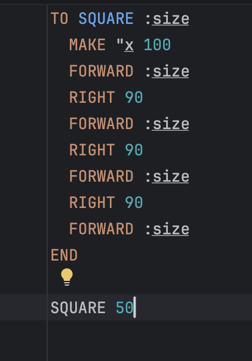
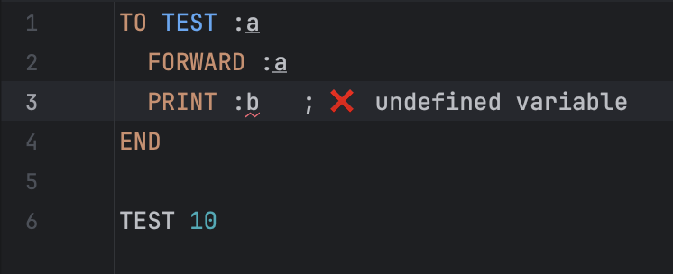

# LOGO Language Server (LSP)

A Language Server Protocol (LSP) implementation for the **LOGO programming language**, developed as part of a JetBrains internship assignment.

This project provides essential IDE-like features such as syntax highlighting, navigation, and code insights for LOGO programs.

---

## ✨ Features

### Core Requirements

* ✅ Syntax highlighting for all LOGO language elements
* ✅ Go-to-declaration for:

    * Procedures
    * Variables

### Additional Features

* 🔍 Hover information
* 🎯 Document highlight
* ⚠️ Diagnostics (basic error detection)

---

## 📸 Features Preview

### Syntax Highlighting



### Go-to-Declaration



### Hover



### Document Highlight



### Diagnostics



---

## 🛠 Tech Stack

* Kotlin
* Gradle
* LSP4J

---

## 🚀 Getting Started

### 1. Clone the repository

```bash id="c6v9rr"
git clone https://github.com/Davlatbek549/logo-lsp-server.git
cd logo-lsp-server
```

---

### 2. Build the project

```bash id="d2e7ba"
./gradlew build
```

---

### 3. Run the server

```bash id="w60vkw"
./gradlew run
```

---

## 🔌 Connecting to an LSP Client

This server can be used with any LSP-compatible client (e.g., LSP4IJ).

Basic setup:

1. Configure a new language server
2. Use the command:

   ```bash
   ./gradlew run
   ```
3. Associate the server with `.logo` files

---

## 🧪 Example

```logo id="jgy94u"
TO SQUARE :size
  MAKE "x 100
  FORWARD :size
  RIGHT 90
  FORWARD :size
  RIGHT 90
  FORWARD :size
  RIGHT 90
  FORWARD :size
END

SQUARE 50
```

---

## 🏗 Architecture Overview

* **analysis/** → parses LOGO code and extracts symbols
* **model/** → core data structures
* **features/** → LSP feature implementations
* **server/** → LSP server setup
* **state/** → document state management

---

## 💪 Strengths

* Clean and modular structure
* Covers all required assignment features
* Includes additional useful LSP features
* Easy to understand and extend

---

## ⚠️ Limitations

* Not a full LOGO implementation
* Regex-based parsing (no full parser)
* Limited support for complex syntax
* Basic diagnostics only
* Single-file analysis (no cross-file support)

---

## 🎯 Purpose

This project demonstrates:

* understanding of the Language Server Protocol
* ability to design modular systems
* implementation of real IDE features

---

## 👤 Author

Davlatbek Mamadaliev
